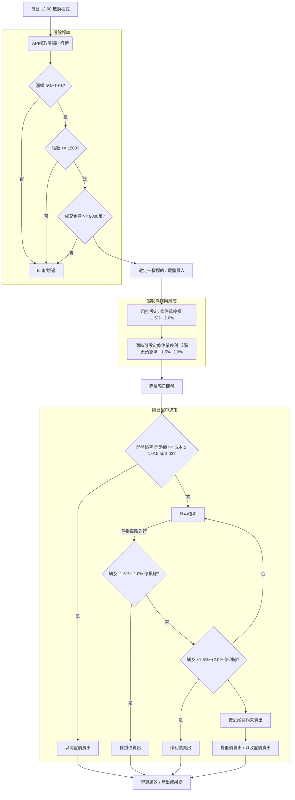
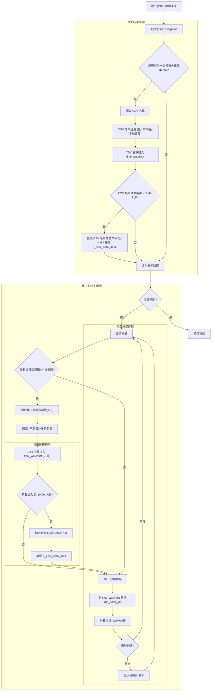
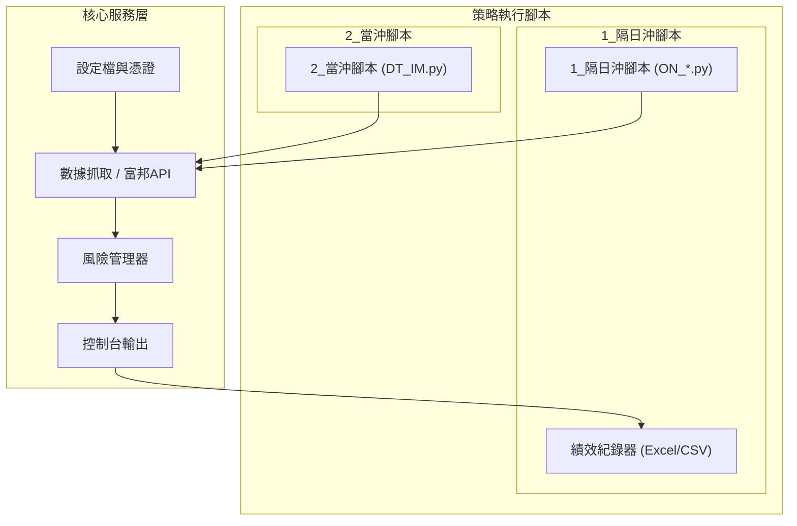

# 股票交易策略分析專案

**聲明：** 本策略內容僅供個人研究、學習及興趣用途，所有的分析和模擬結果均不代表任何投資建議。

---

## 專案概述 (Project Overview)

本專案是一個基於 Python 程式化交易框架，旨在**系統化分析與實證回測兩種經典的台股短線動能策略**：

1.  **隔日沖策略 (One-Night Swing)：** 捕捉強勢股的隔日續漲慣性，進行收盤買入、隔日賣出的動能溢價交易。
2.  **當沖策略 (DayTrade Strategy)：** 著重於盤中即時訊號判讀，利用技術分析（如 K 棒型態、KD/MACD 等）捕捉日內上漲機會。

專案結構清晰，包含數據抓取、策略核心、風控機制及績效紀錄等模組，旨在提供一個可供程式開發者驗證交易邏輯的**研究與學習平台**。

---

### 一、隔日沖策略（One-Night Swing Strategy）

#### 策略核心
本策略旨在捕捉股價在當日被大量資金追捧而強勢上漲（強勢股）後，市場預期隔日仍有買盤動能或高點賣出機會的慣性，利用隔日續漲的動能溢價，進行當日收盤買入，隔日開盤或盤中賣出的短線操作。

#### 選股標準（買入標的）

每日收盤後，從台股市場中篩選出符合以下條件的股票：

| 條件 | 具體要求 | 說明 |
| :--- | :--- | :--- |
| **當日漲幅** | $\mathbf{5\%}$ 至 $\mathbf{10\%}$ | 鎖定具備強勁上漲動能的標的。 |
| **股價與均價** | 股價 $\mathbf{>}$ 當日成交均價 ($\mathbf{VWAP}$) | 確保買入時股價仍維持在多數交易的成本之上，顯示買盤強勢。 |
| **流動性** | 成交張數 $\mathbf{\ge 1,000}$ 張 | 排除流動性風險股（如 $\text{ETF}$、公司債及成交量過低的標的），確保能順利買賣。 |


#### 執行細節（買入與賣出）
1. 買入執行
從符合上述所有條件的清單中，選定一檔標的，於當日**收盤前（或尾盤）**執行買入。

（備註：清單紀錄將於隔日績效結算，產出「前一日成果榜」。）

2. 隔日賣出與風控
隔日主要目標是在動能溢價下獲利了結，並嚴格執行停損：

| 操作類型 | 目標/觸發條件 | 執行方式 |
| :--- | :--- | :--- |
| **獲利目標** | 獲利 $\mathbf{1.5\%}$ ~ $\mathbf{2.0\%}$ （基於買入成本） | 可利用跳空開高的可能性，於**盤前預掛單**，以實現更佳利潤。 |
| **停損機制** | 損失達 $\mathbf{1.5\%}$ ~ $\mathbf{2.0\%}$ （基於買入成本） | 損失觸及時立即執行停損。建議**購買當晚即設定停損條件單**以防護風險。 |

#### 績效追蹤與分析

1. 榜單紀錄
    - 紀錄每日符合選股條件的股票清單。
    - 於次日結算其賣出績效，產出**「前一日成果榜」**。

2. 績效彙總分析
    - 可彙總指定週期內（符合 *_漲幅.xlsx 命名規則）的交易紀錄。
    - 進行價格區間的勝率統計分析，例如：
        - 股價 $\le 50$ 元的勝率
        - 股價 $50$ ~ $100$ 元的勝率
        - 股價 $100$ ~ $200$ 元的勝率等。

---

### 二、當沖策略（DayTrade Strategy）

#### 策略核心邏輯
本策略著重於盤中即時判斷，透過技術分析，在單一交易日內捕捉股票可能上漲的機會。

#### 監測名單來源
透過以下三種方式來建立監測清單：

1. API 抓取： 預設透過 API 抓取市場熱門榜股票。

2. 客製化清單： 自行輸入股票代號的 list 來客製化監測名單。

3. 大單匯集： 使用如「三竹大單匯集」排行榜，導出 CSV 檔案進行製作監控名單。

#### 盤中判讀（訊號判斷）
針對篩選出的熱門股，主要觀察 5 分 K 棒，並利用以下技術分析指標（任一或組合）來捕捉即將上漲的股票：
| 分析指標/工具 | 判讀重點 |
| :--- | :--- |
| **K 棒型態** | 判讀如「多頭趨勢回檔後買入上漲」等特定型態。 |
| **KD 指標** | 判斷股價超買、超賣區域，以及潛在的趨勢轉折點。 |
| **MACD 指標** | 判斷股價的動能強弱與趨勢方向。 |
| **成交量分析** | 遵循「量比價先行」原則，判斷是否有增量突破的潛力。 |

#### 停利/停損機制
由於當沖操作的複雜性高且變動迅速，需搭配恰當且適合自身風險承受度的停利或停損方式，以便在極短時間內快速決策與執行。

#### 績效紀錄（目前狀態）
此策略目前沒有進行正式且有參考價值的績效紀錄與計算。

- 主要原因： 當沖策略的不穩定性高，且盤中紀錄和參數調整不易。

- 初步觀察： 過去曾測得的結果（無正式紀錄）約有 35% 的操作是上漲獲利的。

---

## 流程圖
#### 1. 隔日沖策略流程圖 (Overnight Strategy Flowchart)


#### 2. 當沖策略流程圖 (DayTrade Strategy Flowchart)

#### 3. 專案模組架構圖 (Component Diagram)



---

## 專案運行與環境要求

本專案程式碼旨在驗證上述策略邏輯，使用者若需運行，需自行準備環境與資料來源。

### 1. 環境設定與依賴安裝

為了避免套件衝突，強烈建議在獨立的 Python 虛擬環境中運行本專案。

**步驟 A：建立虛擬環境**

請確保您的電腦已安裝 Python 3.x 版本。

```bash
# 建立一個名為 'venv' 的虛擬環境
python -m venv venv
```

**步驟 B：啟動虛擬環境**

- Windows 系統 (Command Prompt / PowerShell):

```
.\venv\Scripts\activate
```

- macOS / Linux 系統 (Bash / Zsh):
```
source venv/bin/activate
```

**步驟 C：安裝專案依賴**

虛擬環境啟動後，使用 requirements.txt 安裝所有必要的套件，包括 富邦.whl 檔案：

```
# 確保您位於專案根目錄
pip install -r requirements.txt
```

### 2. 資料與憑證
* 本專案資料來源依賴 富邦證券 提供的 API 服務。
* 使用者需自行申請 API 憑證，並在程式碼中指定的 config 內填入。

### 3. 執行步驟
1.  安裝環境：`pip install -r requirements.txt`
2.  配置憑證：編輯 config.json，填入您的憑證。
3.  執行程式：
    - 隔日沖策略：
        1. 盤中接近尾盤前，執行 `python ./oneNight/ON_ranking.py`  製作榜單
        2. 隔天收盤後，執行 `python ./oneNight/ON_calc_pf.py` 當天賣出績效結算 (`python ./oneNight/ON_calc_pf_15.py` _15的是以 $\mathbf{1.5\%}$ 作停損機制，預設則是以 $\mathbf{2.0\%}$)
        3. 執行 `analyze_by_onenight.ipynb` 計算區間價位的勝率(使用jupyter notebook 執行)
    - 當沖策略：執行 `python ./dayTrade/DT_IM.py`

---

##### 作者：Billy Chen (BillyE5)